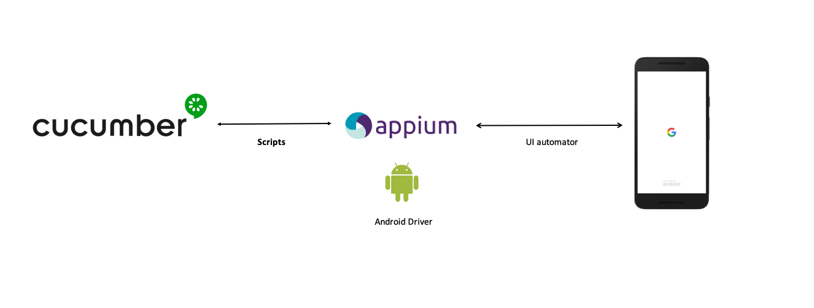

## Global overview

- Scenarios are defined with [Gherkin
Syntax](https://cucumber.io/docs/gherkin/).

- Steps are interpreted by [Cucumber](https://cucumber.io/).

- Step implementation language:
[Java](https://docs.oracle.com/javase/7/docs/)

- Device interaction with [Appium](http://appium.io/)


## Requirements

Different requirements:

* `Appium` instance running and reachable. Check this [link](http://appium.io/docs/en/2.0/) to get futher info about Appium Server. Or go here  [link](https://saucelabs.com/resources/webinar/an-introduction-to-appium-desktop) to get information on using Appium Desktop.

* At least, one device/emulator attached and reachable via adb. Check command
`adb devices` to ensure `Appium` will get the device reference to
interact with it.

* The environment variable `$ANDROID_HOME` needs to be correctly set up,
pointing to the Android SDK folder


## :rocket: Quick Start - Appium set up on Windows (Android):

1) Install [Java JDK8](https://www.oracle.com/java/technologies/javase/javase8-archive-downloads.html)
   and [IntelliJ IDEA](https://www.jetbrains.com/idea/download/)
2) Install [NodeJS](https://nodejs.org/en/download/)
3) Install [Android studio](https://developer.android.com/studio)
4) Install Appium Server (v2.x) using npm (CLI) command `npm install -g appium@next`
```
   Appium server version 2.0.0-beta.55
```

```
Command to check the installed appium version: `appium --version`
```

5) Add below Android SDK path in the environment variable

```
    - ANDROID_HOME = <path to Sdk folder>
    - %ANDROID_HOME%\tools
    - %ANDROID_HOME%\tools\bin
    - %ANDROID_HOME%\platform-tools
```

6) Install Maven and configure Maven Home by following the instructions here [Link](https://gist.github.com/mohanpedala/943e0955d988ca56fa32cb976395548b) 
6) Install [Appium desktop](https://github.com/appium/appium-desktop/releases/)
7) Install [Appium Inspector](https://github.com/appium/appium-inspector/releases)

## :rocket: Quick Start - Appium set up on MAC (Android):

1) Install Homebrew
2) Install [NodeJS](https://nodejs.org/en/download/)
3) Install [Java JDK8](https://www.oracle.com/java/technologies/javase/javase8-archive-downloads.html)
   and [IntelliJ IDEA](https://www.jetbrains.com/idea/download/)
4) Install Appium server using npm (CLI) or Appium desktop client
5) Install [Android studio](https://developer.android.com/studio)
6) Install Maven and configure Maven Home by following the instructions here [Link](https://gist.github.com/mohanpedala/943e0955d988ca56fa32cb976395548b) 
7) Install [Appium Inspector](https://github.com/appium/appium-inspector/releases)
8) Set JAVA_HOME and ANDROID_HOME environment variables

## :pushpin: Appium Doctor to verify the installations

1) Install appium-doctor using command `npm install -g appium-doctor`
2) To view the list of available options `appium-doctor --help`

```
To check Android set up `appium-doctor --android`
To check ios set up `appium-doctor --ios`
```

## :pushpin: Creating Android Virtual Device (Emulator) from Android Studio:

1) Open Android Studio.
2) Click on Tools -> AVD Manager -> Create Virtual Device -> Select the device and OS version -> Finish.
3) Once Virtual device is created, click on Launch this AVD in the emulator.
4) Command to view the list of devices attached `adb devices`


# 📌: Repo & Project Setup:
* Create your own repository to store this project and all of your work.  
* **Fork** or **Clone** this repository (**SDETII_Technical_Test**) to your local machine, and then push your work to your repository.


# 📌 Pull Requests and Code Review:  
* This is **optional**, but if you want good feedback on your submitted solutions you can create a **Pull Request** (in _your_ repository) and notify us when it is ready for review. There's an example Pull Request in **this** repository for reference: https://github.com/HelloImKevo/GroovyPaymentApp-Senior/pull/2  
* Additional information can be found under the [Git Workflow References](#git-workflow-references) section. 


# 📌 Expectations:
* Okay, **phew**. If you made it this far, you're in good shape :+1: hopefully that stuff didn't take too much time (it gets easier with practice).  
* This project is effectively a coding assessment designed to help us identify your **Skills** and **Areas of Expertise** and **Attention to Detail**, while providing you a little bit of exposure to our **Git Workflow**. Finally, The task at hand is right below! 😃 


## :pushpin: Create automated scripts to test ecommerce mobile app place order as a guest feature

### write automation scripst to automate the below scenarios

**Scenario: 01** Customer add products in his shopping cart

> **_Given:_** Mike on home page after opening nopCart mobile app  
> **_When:_** Mike click "electronics" from our categories list from home page  
> **_And:_** Mike click to "Nokia Lumia 1020" product details page  
> **_Then:_** Mike select size "Large" from product details page  
> **_And:_** Mike click plus button to increase Qty by "2"  
> **_Then:_** Mike click add to cart button to add the product in his cart

**Scenario: 02** Customer successfully place order as a guest user

> **_Given:_** Mike go to shopping cart by clicking top cart icon  
> **_When:_** Mike click checkout button from shopping cart page  
> **_And:_** Mike select checkout as guest from shopping cart page  
> **_Then:_** Mike input all the details in checkout billing details page and click continue  
> **_And:_** Mike select "Next Day Air" as shipping method and click continue  
> **_And:_** Mike select "Check/Money Order" as payment method and click continue  
> **_And:_** Mike click next button on payment information page  
> **_Then:_** Mike click confirm button to place the order  
> **_And:_** Verify order place successfully with popup message "Your order has been successfully processed!"

### Additional functionalities, that may be covered:

1. The more, the better. Only if it makes sense. Use your imagination and write some additional tests if you feel you
   can cover other important functionalities.
2. Please include any third party test reporting tools(Ex. Extent Report, Allure report) in your automation project.
3. Please use Excel/csv file as external test data provider and your automation script have the ability to read and
   write data from excel/csv for above scenario(Ex. Billing/shipping address and all the quoted value in scenario step
   can be read from excel as test data)

### :pushpin: Using automation framework is a must:

You can feel free to choose the framework with page object modal design pattern, that suits you best, along with the
Java or other programming language as you preferred.

### :pushpin: Record a video of tests execution:

If possible, record a video to show how your tests are interacting with the mobile app(In Emulator). Attach the video as part of your
solution. (Totally not necessary) 😏


# 📌 Submission Review Guidelines:  
* After you push commits to the project, our team will **Review** your work and provide **Constructive Feedback** the day of the interview on how to improve your code readability, code organization, your approach to solving the problem, or sometimes we will just banter about random technology trends or the latest data breaches :grimacing:
* Oftentimes, code style is **Subjective**, and there's no right or wrong answer, and that's okay! If you disagree with our feedback, let us know why you wrote it that way - we look forward to learning new things and better practices from you :grin:  
* Code style and consistency is important to us - we take pride in every line of code we write, and encourage you to do the same.
* We are more interested in the **Quality** of your submissions, rather than the quantity of submissions.  Quality is assessed using some of these parameters:  
  * Is the **Code Style** consistent? (Do variables follow the same standard conventions? Is the code formatted with the same indentation levels?)  
  * Is the **Git History** clean and well-organized? Can we run a `git log --oneline` and figure out how the candidate implemented their solution for the task? Recommended reading: https://chris.beams.io/posts/git-commit/
  * Are the methods / functions designed to be small and **Focused**? (It is, however, recognized that long methods are sometimes appropriate.)  
  * Is complex or obscure logic **Documented**? Are comments used effectively?  
  * Does the **Code Architecture** follow recommended developer patterns?


# 📌 Questions or Concerns?  
* For any company-related or interview-related questions, reach out to your point-of-contact (likely a **Hiring Manager**).  
* If you would like to keep your work in a **private repository**, please notify the **Hiring Manager**, and they will provide you a list of email addresses for the code reviewers that you'll need to invite as collaborators to your repository.  
* If you have **technical questions** or need assistance with this project, ask the **Hiring Manager**, and they will provide you with the email addresses of one of our team members, and you can email us your question directly, and we will do our best to help. Good luck and Happy Coding!! 💻  

